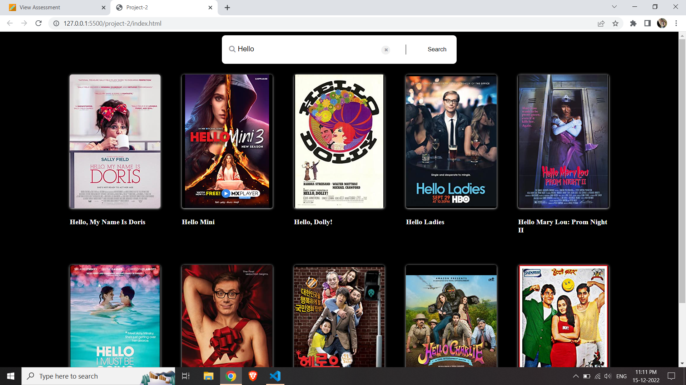

#Project2 - omdbapi

Name: Vinay Muthyapu

I have worked on html document creation.

html - linked CSS to html also implemented the onsubmit button to call the implemented java script functionality.
       placed the required place holder for the java script to populate the data also filter as per the search query.

