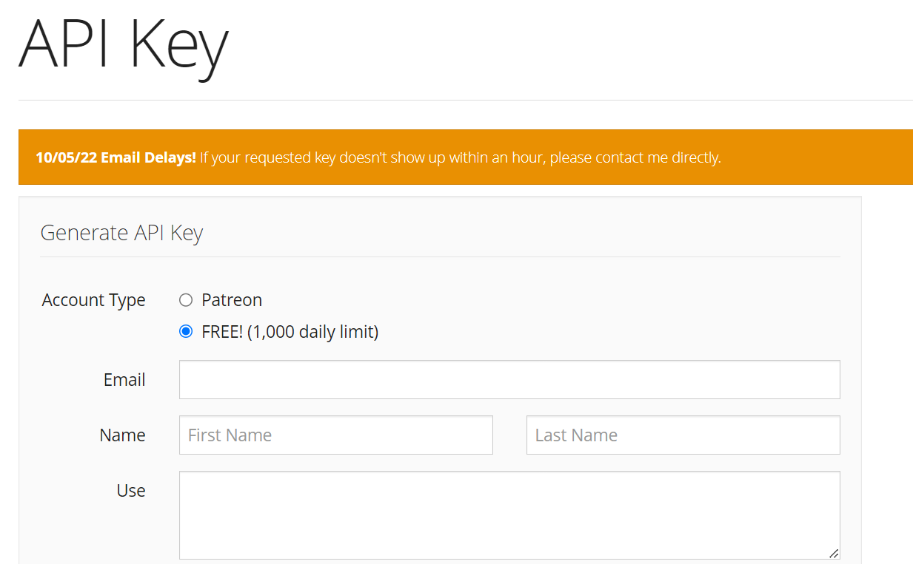
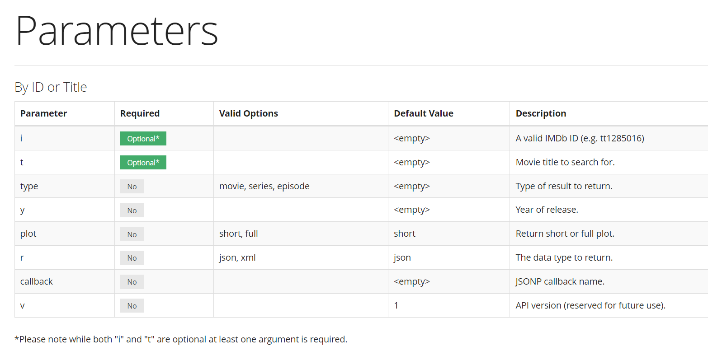
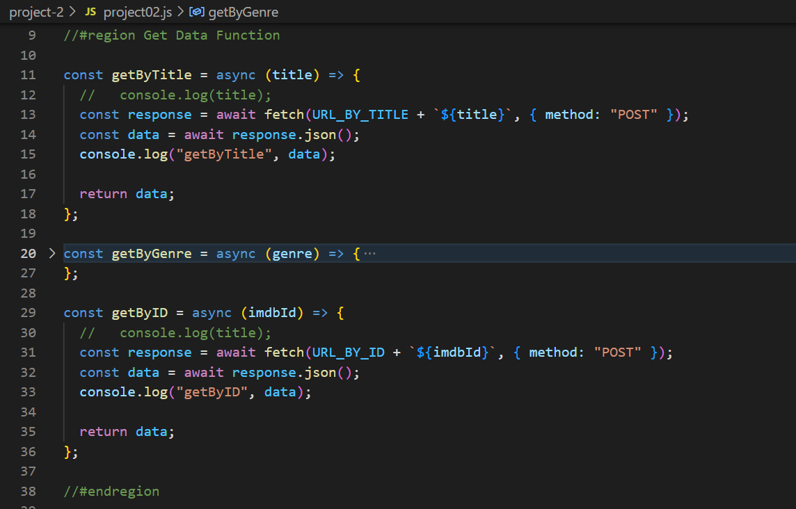
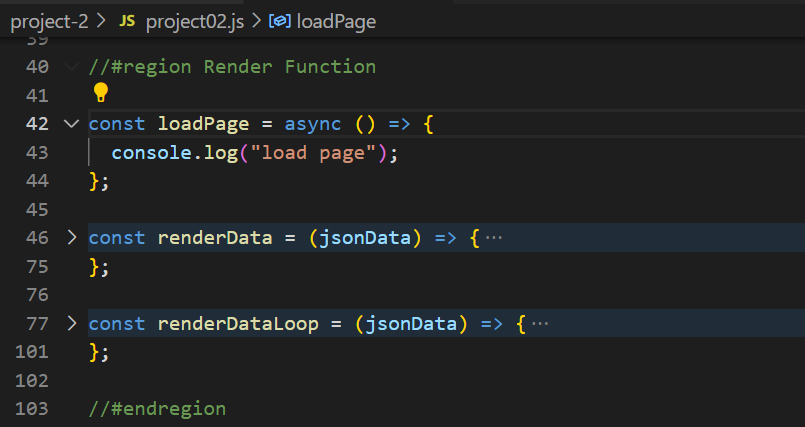
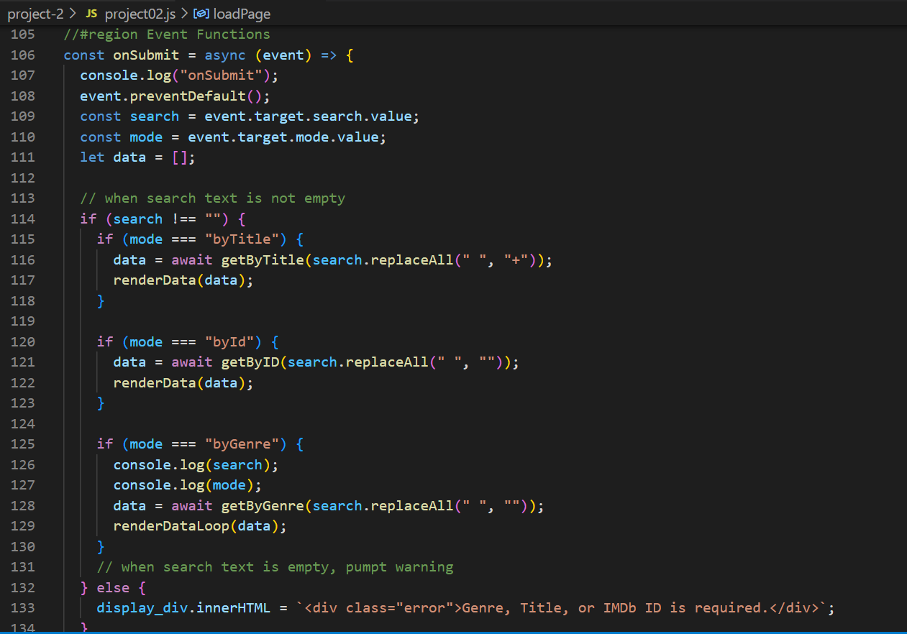

# Project - 02

- Name: Wenhao Fang
- Id: n01555914
- Contribution: Create `xslt` to display data in the table format, based on the xml file created by Meghna.

---

1. Analyze API

   - url: "http://www.omdbapi.com/"
   - Token: the API uses an API key as token. So I register with email address for the API key.
     

   - Data: the API provides information about movies, searching with different parameters listed in the page.
     

---

2. Create `project02.html` that displays data, attaching to the js file `project02.js` that loads data from API.

---

3. Create region of Get Data Function that contains `getByTitle()`, the function to get movie by the full movie title, `getByID()`, the function to get movie data by IMDb ID, and `getByGenre()`, the function created by Meghna to get movies based on the input.

   - Each get function uses `fetch` function to request a url accordingly, then get the json from the response.
   - each get function is `async` function.

   

---

4. Create region of Render Function that contains `renderData()`, the function to display json data into html, and `renderDataLoop()`, the function created by Meghna to display data from `getByGenre()` into html.

   - Render function are subject to be changed by the team member who designs html and css.

   

---

5. Create region of Event Functions to include `onSubmit()` and `onReset()` for submit and resent event.

   - In `onSubmit()` function, the default bevaior will be stopped by `event.preventDefault()`.
   - Then get the keyword and mode to search from the input and radio elements.
     - If the keyword is empty, then a warning message will show in red.
     - If the keyword is no empty, it calls different function to get json data based on the value of mode and then render the json data into html.

   

   - `onReset()` function will clear the render in html.

---
