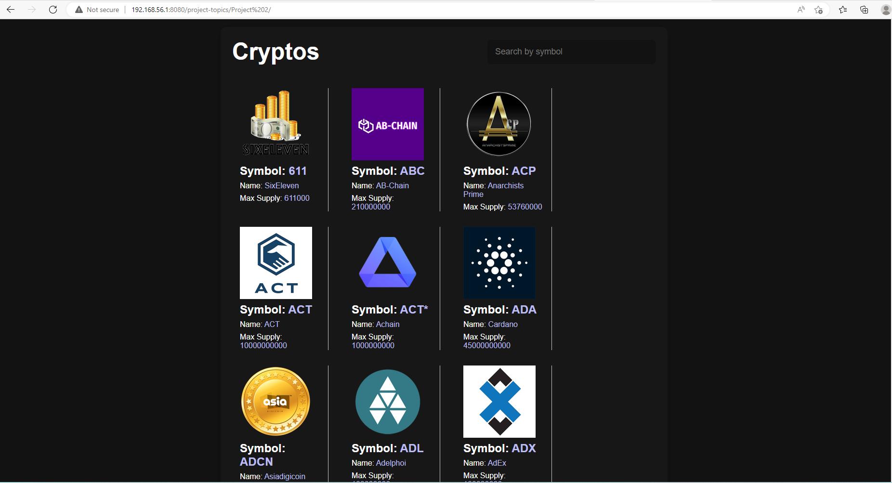

# My part in this project

I handled the CSS aspect of this project and i was able to extensively reseach on the styling of the coinlayer design and came up with the following concepts
a.  *::before , ::after tags which assisted in inserting content before  and after the proposed element
The body and container tags which had the font-family "sans-serif" with a boxing shadow , border radius and black background color and padding inclusive
the h1  element had a font-size of 3rem
search-form (centered align-items with border radius of 8pixels) , search-input( height & width, transparent background and font-size or 1.1rem) and search buttons to augment all
The rates wrapper, rate-icon and info-wrapper were all tweaked to match the overall design displayed.

