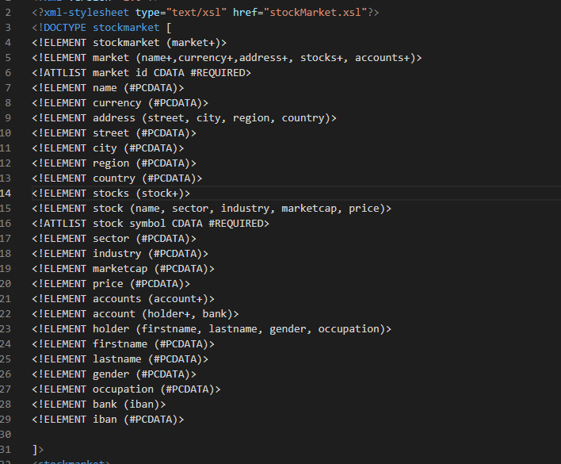

# My contribution

I worked on the DTD aspect of this project which was in line of the XML which was a complex data type. I focused on the following
The root element which was [stockmarket] was the DOCTYPE name
Element [stockmarket] had a nested element market which appeared multiple times in the chain thus (market+) was used to depict it
All internal elements (name, currency, address, stocks and accounts) appeared multiple times thus the “+”  sign appended to them to make their declaration more readible
The attributes “id” in market element and “symbol” in Stock element carry CDATA datatype entities (Character Data) that is not supposed to be parsed
Other sub-elements in between from root [stockmarket] down to [iban] were Parse Data Character datatype entities (#PCDATA) that was parsed by the parser in the declaration

