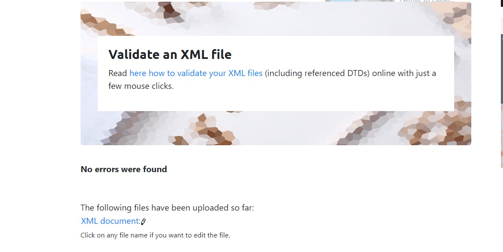
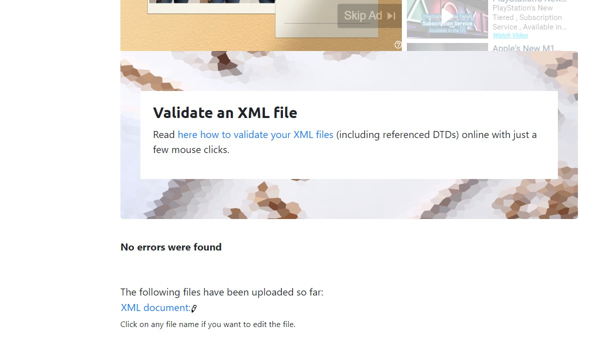
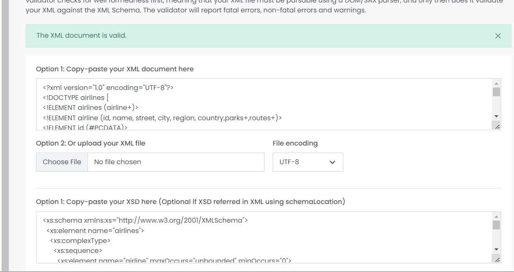
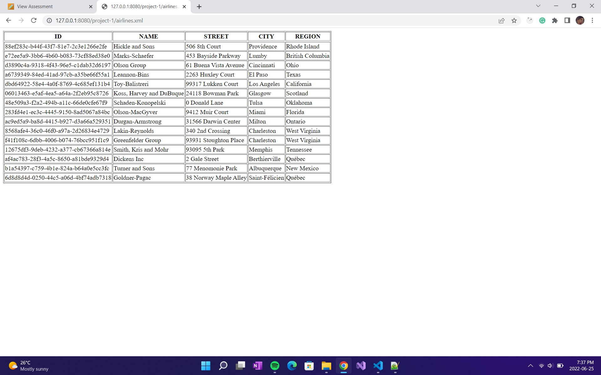
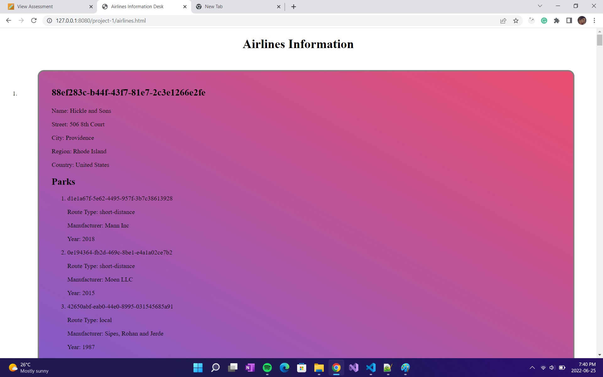

                                                            PROJECT-1
---------------------------------------------------------------------------------------------------------------------------------------------------
For this project-1, I and Mudit worked together as a team and completed the whole project by dividing the work 
equally. For my part of project we decided that i'll work on :

1) XML 
   Designing and creating the xml file based on topic assigned to each group.
   While designing the xml file firslty, i understood the Json file given to us that how the data has has been segmented on the basis of which i created the xml for it. For the root name i gave it as *airlines* and divided each segment into *airline*. After that added the data as given in the json to the xml. Used the specified tags needed for each element and created an xml tree like structure from the root and branches from root to child elements.
   For each segment i created a seperate tag to make xml look more clean and easy to understand. 
   Like, for parks, routes i created a seperate tag for it inside whixh child elements were declared.
   -----------------------------------------------------------------------------------------------------------------------------------------------
   VALIDATED XML
   

2) DTD
   Create dtd for created xml file
   For the DTD we basically have to follow a designated pattern or a syntax. So, for that i simply started with writing Document Type Declaration, elements, attributes, entities, and several keywords according to the xml file we created. 
   <!DOCTYPE airlines [ ]> ------ DECLARATION
   After that all the elements were declared for all the child branches. Used #PCDATA(parsed character data) where ever it was required.
   In the JSON file for destination and departure we had different tags. In some segments *region* was missing and in some it was there. So, for that i figure out how to validate dtd correctly for that. Then i learned to make that correct one should add *?* to do so. (if a element repeats more than once).
   In this way i created the DTD for this project.
   ------------------------------------------------------------------------------------------------------------------------------------------------
   VALIDATED DTD
   

3) XSD
   Create xsd for created xml file
   As the data in the JSON file was properly segmented it became easy to make an xsd for the same. So, for xsd i started writing with set of components such as element declarations and type definitions that specify the structure and semantics of elements and attributes for the above created XML. For each segment i created a sequence and stored all the elements inside it as:
    <xs:sequence>
              <xs:element  name="id" type="xs:string"/>
              <xs:element  name="name" type="xs:string"/>
   like this.
   In xsd basically, we have to declare:
   * Data types for elements and attributes
   * Default and fixed values for elements and attributes.

   So, in this way i created the xsd for the *project airlines*
   ------------------------------------------------------------------------------------------------------------------------------------------------
   VALIDATED XSD
   

4) XSLT
   I and Mudit together made the xslt file for the given project topic.
   For xslt we discussed that how are we going to display the data in the tabular format and in what way it should be done. We dicussed and implemented it together and then ended up making nested element structure.
   

