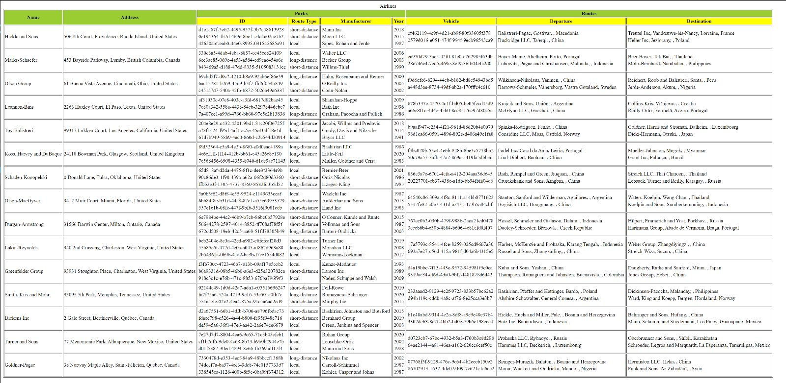
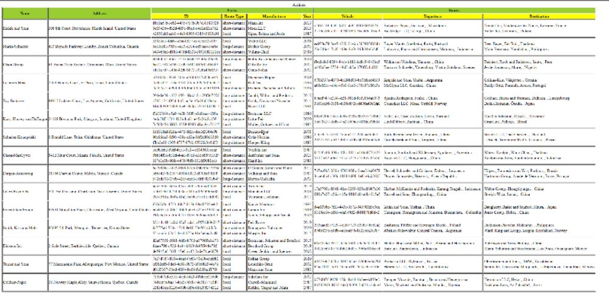

## Our team is assigned to perform operations on the Airlines.json file.
I started the project with designing a xml file from the given JSON file

Name: Bhavish Rohilla
Student ID: n01532797

My contribution:
--> I have made airlines.xml and helped in completing airlines.xsl
I tried to keep it as simple as I could as we had to make other files depending on it.

--> First of all I converted the elements in json to a proper xml elements and attributes.
we have used the complex type and sequence in the file to complete the file.

