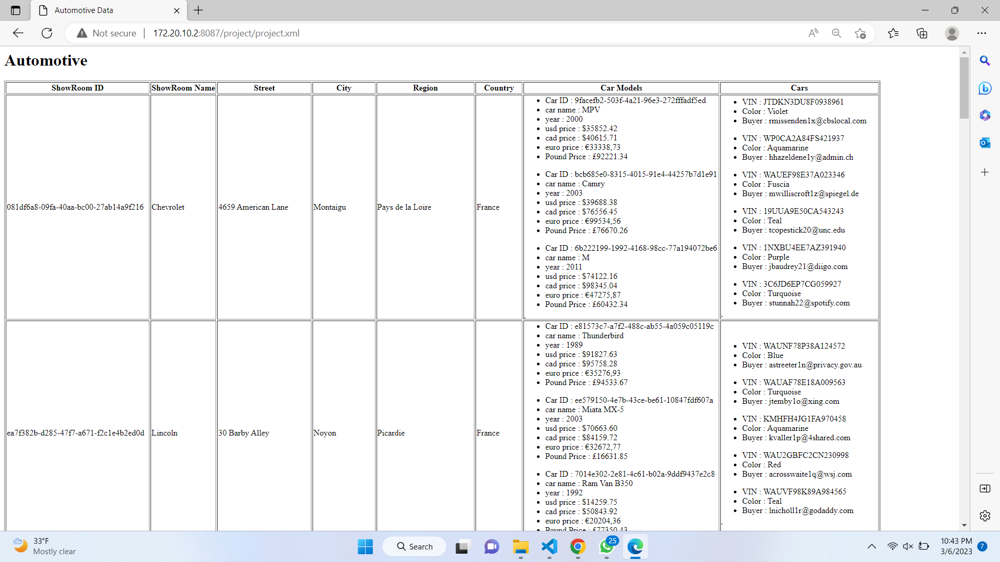

# Project 1

  - Create xslt to display data in the table format
  - 

  ## Documentation

-- in this project I have converted json file to Xml file.
-- based on this xml file I have created xsl file in table format.
-- Me and milap has done html part together.
